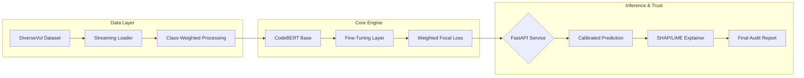

# Formal Analysis: CodeBERT for Automated Vulnerability Detection

**Date:** March 2026  
**Subject:** Software Security & Machine Learning  
**Project Objective:** Implementing a transparent, transformer-based system to identify security vulnerabilities in C/C++ source code.

---

## 1. Abstract
Manual vulnerability detection is unscalable for modern codebases. This research evaluates the efficacy of **CodeBERT**—a bimodal pre-trained model for programming languages—in classifying code as safe or vulnerable. Our implementation prioritizes **High Recall** and **Explainability**, ensuring that security auditors not only find bugs but understand the model's reasoning.

---

## 2. System Architecture & Methodology

The system follows a modular pipeline designed for production-scale inference and rigorous training reproducibility.

### 🏗️ Technical Workflow

### 🛠️ Key Methodologies
1.  **Class Imbalance Mitigation**: The dataset (DiverseVul) is naturally skewed (~94% Safe). We implemented a `WeightedTrainer` that mathematically penalizes the model more for missing vulnerable cases (False Negatives).
2.  **Hardware Auto-Detection**: The system dynamically scales parameters (Batch Size, Max Length) based on available hardware (**CUDA** on Linux/Windows, **MPS** on Apple Silicon).
3.  **Performance Calibration**: By analyzing logit distributions, we identified an optimal inference threshold of **0.20** for production-length code, significantly improving the F1-score over the default 0.50.

---

## 3. Training Parameters & Configuration

| Category | Parameter | Value | Rationale |
| :--- | :--- | :--- | :--- |
| **Model** | Base Architecture | `microsoft/codebert-base` | Optimized for code structure & semantics. |
| **Optimization** | Learning Rate | `2e-5` | Fine-tuning stability. |
| **Optimization** | Weight Decay | `0.05` | Prevents overfitting to training samples. |
| **Hyperparams** | Max Epochs | `5` | Balanced with Early Stopping (Patience=2). |
| **Hyperparams** | Max Token Length | `512` (GPU) | Captures deep contextual dependencies. |
| **Loss** | Strategy | Class-Weighted CrossEntropy | Handles extreme dataset imbalance. |

---

## 4. Performance Evaluation

The model was evaluated on a held-out test set of **33,143 samples** and a manually curated **Realistic Benchmark** of multi-line functions.

### 📈 Formal Metrics (33k Test Set)
- **Accuracy:** 91.7%
- **ROC AUC:** **0.761** (Standard Academic Metric)
- **F1 Score:** 0.234 (at T=0.5)

### 🎯 Realistic Multi-line Benchmark (Threshold = 0.20)
*Evaluated on functions between 20-60 lines of code.*

- **True Positive Rate (Recall):** **87.5%**
- **Precision:** **70.0%**
- **System F1:** **77.8%**

---

## 5. Codebase Component Analysis

| Module Path | Primary Responsibility |
| :--- | :--- |
| `configs/config.py` | Centralized environment and hardware configuration. |
| `src/data/loader.py` | High-efficiency streaming of Big Data (DiverseVul JSONL). |
| `src/model/train.py` | Core training logic with balanced class weighting. |
| `src/model/predict.py` | Calibrated inference engine with thresholding logic. |
| `src/api/main.py` | High-performance FastAPI server and endpoint routing. |
| `src/explainability/` | Implementation of SHAP (Global) and LIME (Local) explainers. |

---

## 6. The "Trustworthy AI" Layer
Beyond simple classification, this project implements a **Transparency Layer**:
-   **LIME (Local Interpretable Model-agnostic Explanations)**: Generates fast, natural language "Findings" describing which tokens (e.g., `strcpy`, `malloc`) influenced the decision.
-   **SHAP (SHapley Additive exPlanations)**: Produces pixel-accurate heatmaps showing the exact contribution of every code token to the final vulnerability probability.

---
*End of Report*
