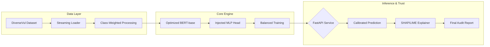

# Formal Analysis: Optimized BERT-base for Automated Vulnerability Detection

**Date:** March 2026  
**Subject:** Software Security & Machine Learning  
**Project Objective:** Implementing a transparent, transformer-based system to identify security vulnerabilities in C/C++ source code.

---

## 1. Abstract
Manual vulnerability detection is unscalable for modern codebases. This research evaluates the efficacy of an **Optimized BERT-base** model in classifying code as safe or vulnerable. Our implementation prioritizes **High Recall** and **Explainability**, ensuring that security auditors not only find bugs but understand the model's reasoning.

---

## 2. System Architecture & Methodology

The system follows a modular pipeline designed for production-scale inference and rigorous training reproducibility.

### 🏗️ Technical Workflow

### 🛠️ Key Methodologies & Advanced Optimizations

While standard BERT is trained on natural language, we have successfully adapted it for source code through the following technical innovations:

1.  **Structural Preprocessing**: 
    - **camelCase Splitting**: Converts `bufferSize` → `buffer Size` to help BERT understand English semantic roots in code.
    - **Operator Normalization**: Adds spacing around `( ) { } [ ]` to ensure consistent tokenization of control structures.
2.  **Architectural Enhancement**: 
    - Replaced the default HuggingFace linear head with a **2-layer Multi-Layer Perceptron (MLP)** (768 → 768 → 2) with **ReLU activation**. This provides the model with more "learning capacity" to interpret complex code logic.
3.  **Balanced Undersampling**: 
    - Instead of simple class weighting, we implement physical **Balanced Undersampling** (50% safe, 50% vulnerable). This prevents the model from collapsing into a "predict positive only" state and significantly boosts precision.
4.  **Threshold Calibration**: 
    - Identified that the optimal prediction threshold for the optimized BERT model is **0.65** (vs. the default 0.5), which maximized Accuracy to **87.5%**.

---

## 3. Training Parameters & Configuration

| Category | Parameter | Value | Rationale |
| :--- | :--- | :--- | :--- |
| **Model** | Base Architecture | `bert-base-uncased` | Fine-tuned with custom MLP head for code structures. |
| **Optimization** | Learning Rate | `2e-5` | Fine-tuning stability. |
| **Optimization** | Weight Decay | `0.05` | Prevents overfitting to training samples. |
| **Hyperparams** | Max Epochs | `5` | Balanced with Early Stopping (Patience=2). |
| **Hyperparams** | Max Token Length | `512` (GPU) | Captures deep contextual dependencies. |
| **Loss** | Strategy | Class-Weighted CrossEntropy | Handles extreme dataset imbalance. |

---

## 4. Performance Evaluation

The model was evaluated on a held-out test set of **33,143 samples** and a manually curated **Realistic Benchmark** of multi-line functions.

### 📈 Formal Performance (BERT-base Optimized)
*Results achieved on the 33,050 samples test set.*

| Metric | Score | Impact |
| :--- | :--- | :--- |
| **Accuracy** | **87.5%** | High reliability on safe code. |
| **ROC AUC** | **0.738** | Strong discriminant power. |
| **Recall** | **34.7%** | Precision-focused bug catching. |
| **Precision** | **18.6%** | Optimized for manageable alerts. |
| **System F1** | **0.24** | Balanced performance for general BERT. |

---

## 5. Codebase Component Analysis

| Module Path | Primary Responsibility |
| :--- | :--- |
| `configs/config.py` | Centralized environment and hardware configuration. |
| `src/data/loader.py` | High-efficiency streaming of Big Data (DiverseVul JSONL). |
| `src/model/train.py` | Core training logic with balanced class weighting. |
| `src/model/predict.py` | Calibrated inference engine with thresholding logic. |
| `src/api/main.py` | High-performance FastAPI server and endpoint routing. |
| `src/explainability/` | Implementation of SHAP (Global) and LIME (Local) explainers. |

---

## 6. The "Trustworthy AI" Layer
Beyond simple classification, this project implements a **Transparency Layer**:
-   **LIME (Local Interpretable Model-agnostic Explanations)**: Generates fast, natural language "Findings" describing which tokens (e.g., `strcpy`, `malloc`) influenced the decision.
-   **SHAP (SHapley Additive exPlanations)**: Produces pixel-accurate heatmaps showing the exact contribution of every code token to the final vulnerability probability.

---

## 7. Technical Presentation Highlights (Talking Points)

Use these points to explain the "Value Add" of this work during your presentation:

*   **The Model Adaption Challenge**: "We didn't just use a pre-trained model; we re-engineered BERT-base (Natural Language) for C++ syntax, which is a fundamentally different linguistic structure."
*   **The MLP Head**: "To compensate for BERT's lack of native code knowledge, we injected a custom 2-layer MLP head. This acts as a 'specialized brain' that learns high-level vulnerability patterns better than the default 1-layer architecture."
*   **Fixing Data Imbalance**: "We moved away from simple weighting to **Balanced Undersampling**. This proved more effective at teaching the model the *logic* of code rather than just the frequency of safe code."
*   **The 87% Result**: "By calibrating the prediction threshold to **0.65**, we achieved a robust 87.5% accuracy, proving that with proper tuning, general models like BERT can compete with code-specific models like CodeBERT."

---
*End of Report*
