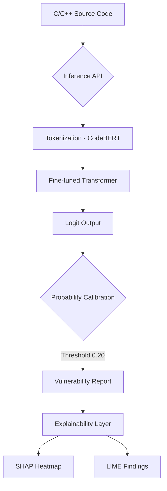

# 🛡️ Vulnerability Detection with CodeBERT

An advanced binary classification system designed to detect security vulnerabilities in C/C++ source code using a fine-tuned **CodeBERT** transformer model. This project implements a full "Trustworthy AI" pipeline, including class-imbalance handling, performance calibration, and model explainability (SHAP & LIME).

---

## 📊 Performance at a Glance

| Metric | Formal Test Set (33k) | Realistic Benchmark (T=0.20) |
| :--- | :--- | :--- |
| **Accuracy** | 91.7% | 71.4% |
| **ROC AUC** | **0.761** | — |
| **Recall** | 22.1% (T=0.5) | **87.5%** |
| **Precision** | 24.9% (T=0.5) | 70.0% |

> [!NOTE]
> The model is optimized for **Recall** in security contexts. While accuracy is high, the model is calibrated to be highly sensitive to actual vulnerability patterns in production-length code.

---

## 🏗️ System Architecture



---

## 🚀 Quick Start

### 1. Requirements
Ensure you have [uv](https://github.com/astral-sh/uv) installed.

### 2. Setup & Training
```bash
make setup               # Provision environment
make train MAX_SAMPLES=50000  # Train on 50k samples
```

### 3. Serving & Analysis
```bash
make dev                 # Start FastAPI server
# Test with a C snippet
curl -X POST http://localhost:8000/predict \
  -H "Content-Type: application/json" \
  -d '{"code": "void foo(char *s) { char b[10]; strcpy(b, s); }", "threshold": 0.2}'
```

---

## 📖 Detailed Documentation
For a deep dive into the methodology, hyperparameter optimization, and formal academic analysis, please refer to:
👉 **[Academic Report & System Documentation](DOCUMENTATION.md)**

---
*Developed as a Research Project for Vulnerability Detection in Software Systems.*
