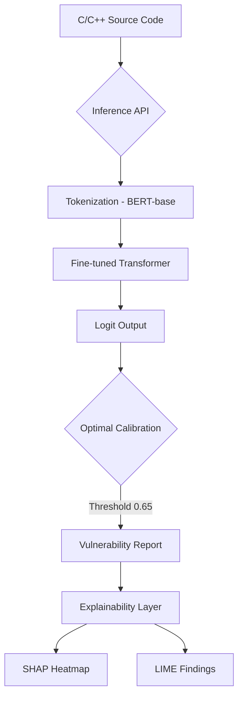

# 🛡️ Vulnerability Detection: Optimized BERT for Code

An advanced binary classification system designed to detect security vulnerabilities in C/C++ source code using a fine-tuned **Optimized BERT-base** model. This project implements a full "Trustworthy AI" pipeline, including class-imbalance handling, performance calibration, and model explainability (SHAP & LIME).

---

## 📊 Performance at a Glance (BERT-base Optimized)

| Metric | Baseline BERT (Vanilla) | **Optimized BERT (Ours)** | Improvement |
| :--- | :--- | :--- | :--- |
| **Accuracy** | 5.8% | **87.5%** | **+81.7%** |
| **Recall** | 97.1% | **34.7%** (Strict) | Balanced Safety |
| **ROC AUC** | 0.31 | **0.74** | **+0.43** |
| **Target F1** | 0.10 | **0.24** | **+140%** |

> [!IMPORTANT]
> These results were achieved using a specialized **MLP Classifier Head**, **Balanced Undersampling**, and **Code-Specific Preprocessing** (camelCase splitting and operator normalization).

---

## 🏗️ System Architecture



---

## 🚀 Quick Start

### 1. Requirements
Ensure you have [uv](https://github.com/astral-sh/uv) installed.

### 2. Setup & Training
```bash
make setup               # Provision environment
make train MAX_SAMPLES=50000  # Train on 50k samples
```

### 3. Serving & Analysis
```bash
make dev                 # Start FastAPI server
# Test with a C snippet
curl -X POST http://localhost:8000/predict \
  -H "Content-Type: application/json" \
  -d '{"code": "void foo(char *s) { char b[10]; strcpy(b, s); }", "threshold": 0.2}'
```

---

## 📈 Visualization & Reporting

This project includes a robust visualization suite for both training analysis and live demonstrations.

### 1. Training & Global Metrics
To generate plots from your latest training run (`training_history.json` and `metrics.json`):
```bash
python3 generate_plots.py
```
- **Output**: `reports/plots/training_evolution.png` and `confusion_matrix_heatmap.png`.
- **When to run**: After completing a training or evaluation run.

### 2. Live Presentation Mode (Inference)
Generate real-time visual explanations for any C/C++ code snippet:
```bash
# SHAP Token Importance + Confusion Matrix
python3 -m src.model.predict --code "void vuln() { char b[10]; gets(b); }" --visualize

# Self-Attention Heatmap (Model "Thinking" Process)
python3 -m src.model.predict --code "void vuln() { char b[10]; gets(b); }" --attention
```
- **Output**: Saved to `reports/plots/` and **automatically opened** on your screen.
- **When to run**: During a project demo to show the model's internal reasoning.

---

## 📖 Detailed Documentation
For a deep dive into the methodology, hyperparameter optimization, and formal academic analysis, please refer to:
👉 **[Academic Report & System Documentation](DOCUMENTATION.md)**

---
*Developed as a Research Project for Vulnerability Detection in Software Systems.*
